# Azure Diagram MCP Server

[](https://github.com/microsoft/diagrams-mcp-server/actions)
[](https://opensource.org/licenses/MIT)
[](https://www.python.org/downloads/)
[](https://modelcontextprotocol.io/)
[](https://github.com/github/copilot-sdk)

An [MCP](https://modelcontextprotocol.io/) server for generating professional infrastructure diagrams using the Python [diagrams](https://diagrams.mingrammer.com/) DSL — with first-class Azure support and [GitHub Copilot SDK](https://github.com/github/copilot-sdk) integration for natural language diagram generation.


## Prerequisites

| Dependency | Install |
|-----------|---------|
| **uv** | [astral.sh/uv](https://docs.astral.sh/uv/getting-started/installation/) |
| **Python 3.12+** | `uv python install 3.12` |
| **Graphviz** | [graphviz.org](https://www.graphviz.org/) or `brew install graphviz` / `apt install graphviz` |

## Installation

| VS Code | Cursor |
|:-------:|:------:|
| [](https://insiders.vscode.dev/redirect/mcp/install?name=Azure%20Diagram%20MCP%20Server&config=%7B%22command%22%3A%22uvx%22%2C%22args%22%3A%5B%22microsoft.azure-diagram-mcp-server%22%5D%2C%22env%22%3A%7B%22FASTMCP_LOG_LEVEL%22%3A%22ERROR%22%7D%7D) | [](https://cursor.com/en/install-mcp?name=microsoft.azure-diagram-mcp-server&config=eyJjb21tYW5kIjoidXZ4IG1pY3Jvc29mdC5henVyZS1kaWFncmFtLW1jcC1zZXJ2ZXIiLCJlbnYiOnsiRkFTVE1DUF9MT0dfTEVWRUwiOiJFUlJPUiJ9fQ==) |

### Manual Configuration

Add to your MCP client configuration (e.g., VS Code `settings.json`, Claude Desktop config):

```json
{
  "mcpServers": {
    "microsoft.azure-diagram-mcp-server": {
      "command": "uvx",
      "args": ["microsoft.azure-diagram-mcp-server"],
      "env": {
        "FASTMCP_LOG_LEVEL": "ERROR"
      }
    }
  }
}
```

### Docker

```bash
docker build -t microsoft/azure-diagram-mcp-server .
```

```json
{
  "mcpServers": {
    "microsoft.azure-diagram-mcp-server": {
      "command": "docker",
      "args": ["run", "--rm", "-i", "--env", "FASTMCP_LOG_LEVEL=ERROR",
               "microsoft/azure-diagram-mcp-server:latest"]
    }
  }
}
```

## Features

| Feature | Description |
|---------|-------------|
| ☁️ **Azure-First** | 100+ Azure service icons — App Service, Functions, Cosmos DB, AKS, and more |
| 🌐 **Multi-Cloud** | AWS, GCP, Kubernetes, on-premises, and custom icon support |
| 📊 **Multiple Types** | Architecture, sequence, flow, class, K8s, and custom diagrams |
| 🔒 **Security Scanning** | AST + Bandit code analysis before every execution |
| 🖼️ **Interactive Viewer** | MCP Apps viewer with pan, zoom, download, and dark/light theme |
| 🤖 **Copilot SDK** | Natural language diagram generation via GitHub Copilot SDK |

## Architecture

```mermaid
graph TB
    subgraph "AI Host"
        VS[VS Code Copilot]
        CD[Claude Desktop]
        CU[Cursor]
    end

    subgraph "MCP Server"
        S[server.py<br/>FastMCP]
        DT[diagram_tools.py<br/>Generation + Examples]
        SC[scanner.py<br/>AST + Bandit]
        V[viewer/app.html<br/>MCP Apps Viewer]
    end

    subgraph "Copilot SDK Layer"
        CC[copilot_client.py<br/>DiagramCopilotClient]
        AG[Custom Agent<br/>azure-diagram-architect]
    end

    VS & CD & CU -->|MCP stdio| S
    CC -->|MCP local| S
    AG --> CC
    S --> DT
    S --> V
    DT --> SC
    SC -->|Pass| DT
    DT -->|Python DSL| GV[Graphviz → PNG]
```



## MCP Tools

| Tool | Description |
|------|-------------|
| `generate_diagram` | Execute Python diagram code with security scanning and timeout. Pre-imports all providers — just start with `with Diagram(...)`. |
| `refresh_diagram` | Regenerate a diagram from updated code (app-only, used by the interactive viewer). |
| `get_diagram_examples` | Get example code by type: `azure`, `sequence`, `flow`, `class`, `k8s`, `onprem`, `custom`, or `all`. |
| `list_icons` | Discover available icons by provider and service. Filter with `provider_filter` and `service_filter`. |

### Recommended Workflow


## Quick Example

```python
from diagrams import Diagram
from diagrams.azure.compute import AppServices, FunctionApps
from diagrams.azure.database import CosmosDb
from diagrams.azure.network import ApplicationGateway

with Diagram("Azure Web Architecture", show=False):
    gateway = ApplicationGateway("Gateway")
    app = AppServices("App Service")
    functions = FunctionApps("Functions")
    db = CosmosDb("Cosmos DB")

    gateway >> app >> db
    gateway >> functions >> db
```

## Copilot SDK Integration

The server includes a [GitHub Copilot SDK](https://github.com/github/copilot-sdk) client that provides a natural language interface to diagram generation — describe what you want and the Copilot-powered architect generates it.


### Interactive CLI

```bash
uv run microsoft.azure-diagram-copilot
```

### Programmatic Usage

```python
import asyncio
from microsoft.azure_diagram_mcp_server.copilot_client import DiagramCopilotClient

async def main():
    async with DiagramCopilotClient(model="gpt-4.1") as client:
        client.on_delta(lambda delta: print(delta, end="", flush=True))
        client.on_idle(lambda: print())

        await client.generate(
            "Create a 3-tier Azure architecture with App Gateway, "
            "App Service, and Cosmos DB"
        )

asyncio.run(main())
```

### BYOK (Bring Your Own Key)

Use your own LLM provider — no Copilot subscription required:

| Variable | Description |
|----------|-------------|
| `DIAGRAM_COPILOT_PROVIDER_TYPE` | `openai`, `azure`, or `anthropic` |
| `DIAGRAM_COPILOT_BASE_URL` | API endpoint URL |
| `DIAGRAM_COPILOT_API_KEY` | API key |
| `DIAGRAM_COPILOT_WIRE_API` | `completions` or `responses` |
| `DIAGRAM_COPILOT_MODEL` | Model override (default: `gpt-4.1`) |
| `DIAGRAM_COPILOT_AZURE_API_VERSION` | Azure API version (default: `2024-10-21`) |

```bash
export DIAGRAM_COPILOT_PROVIDER_TYPE=azure
export DIAGRAM_COPILOT_BASE_URL=https://your-resource.openai.azure.com
export DIAGRAM_COPILOT_API_KEY=your-api-key
uv run microsoft.azure-diagram-copilot
```

### Resumable Sessions

```python
client = DiagramCopilotClient(session_id="my-project-diagrams")
await client.start()
await client.generate("Create an Azure web app diagram")

# Resume later
await client.resume("my-project-diagrams")
await client.generate("Add a Redis cache to the previous diagram")
await client.stop()
```

## Development

```bash
# Setup
uv sync --group dev

# Test (140 tests, 9 skip without Graphviz)
uv run pytest tests/ -v

# Lint + format
uv run ruff check microsoft/ tests/
uv run ruff format --check microsoft/ tests/

# Type check
uv run pyright

# Coverage
uv run pytest --cov=microsoft --cov-report=term-missing tests/
```

See [AGENTS.md](AGENTS.md) for comprehensive contributor documentation covering architecture, conventions, testing patterns, CI/CD, and the GitHub Pages docs site.

## Documentation

📖 **[microsoft.github.io/diagrams-mcp-server](https://microsoft.github.io/diagrams-mcp-server/)** — Full documentation built with VitePress, deployed via GitHub Pages.

```bash
cd docs-site && npm install && npm run docs:dev  # Local dev server
```

## License

This project is licensed under the MIT License — see the [LICENSE](LICENSE) file for details.

## Contributing

This project welcomes contributions and suggestions. See [AGENTS.md](AGENTS.md) for the full development guide.